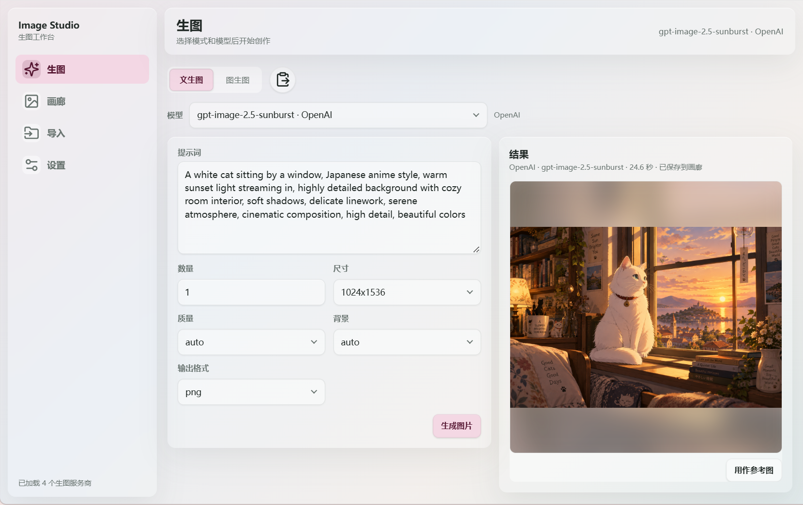

# Image Studio

在 AstrBot 中生成、编辑和管理图片。既能打开 WebUI 调整参数，也能在聊天中使用指令，或让 Agent 把生图作为任务中的一步，继续改图、拼接和制作其他作品。

当前开发版本为 **1.3.0-dev.1**，基于正式版 **1.2.0** 继续开发。新增独立的 NovelAI 官方接口适配，已完成离线测试，真实账号联调仍待完成；原有 NAI 第三方接口继续可用。完整变化见 [更新记录](CHANGELOG.md)。



*界面示例使用演示数据，不代表实际模型的生成效果。*

## 可以做什么

| 功能             | 你可以做的事                                                             |
| ---------------- | ------------------------------------------------------------------------ |
| 多服务商生图     | 接入 OpenAI Images、Gemini、NovelAI 官方、NAI 第三方及自定义 JSON 接口   |
| 文生图与图生图   | 按模型能力显示参数，上传多张参考图，或将成图继续用作参考                 |
| 批量生图         | 自动按模型原生批次拆分请求，并发生成多张图片，成功结果保存在同一图组     |
| Agent 图片工作流 | 让 Agent 查询模型、生成和查看图片，再发送原图或交给工作区继续处理        |
| 画廊             | 搜索、筛选、收藏、复现参数，批量导出和删除图片                           |
| 图片导入         | 读取 NovelAI、ComfyUI、Stable Diffusion 图片中的生成信息，单图或图组归档 |
| 外部图库         | 将 NAI 插件历史或自定义目录中的图片加入画廊，原图保留在来源目录          |
| 手机浏览         | 滑动切图、全屏查看、捏合与双击缩放，随时下载原图                         |

## 快速开始

### 1. 安装插件

需要 **AstrBot 4.26.5 或更新版本、Python 3.12+**，以及可用的图片生成服务。模型服务的密钥和费用由对应服务商提供。

在 AstrBot 的插件管理中通过仓库地址安装：

```text
https://github.com/Eco404/astrbot_plugin_image_studio
```

也可以从 [Releases](https://github.com/Eco404/astrbot_plugin_image_studio/releases) 下载 ZIP 安装。安装后，在插件详情中打开 **Image Studio** 页面。

从旧版升级前，请停止 AstrBot 并备份完整插件数据目录。1.2.0 沿用正式 v2 数据库，1.1.0 用户无需数据库迁移；1.0.0 用户会按既有路径升级到 v2。首次升级前会自动备份数据库，失败则回滚。自动备份不包含图片和配置，详细兼容范围与恢复方法见 [开发与升级说明](https://github.com/Eco404/astrbot_plugin_image_studio/blob/main/docs/DEVELOPMENT.md)。

### 2. 配置服务商和模型

```text
添加服务商 → 添加模型 → 设置默认模型 → 开始生图
```

打开 WebUI 的「设置」：

1. 在「生图服务商」中新增服务商，选择接口类型，填写地址和密钥。
2. 在「模型配置」中添加模型，确认它支持文生图还是图生图，以及参考图数量和默认参数。
3. 在「默认模型」中分别设置 **页面** 和 **工具** 使用的默认文生图、图生图模型。

服务商负责连接，模型负责能力和参数。同一个服务商可以配置多个能力不同的模型。支持模型列表查询的服务商可点击「获取模型」辅助填写，也可以手动输入；自动获取不到的能力需要自行确认。

每个服务商可单独填写「网络代理」，支持 HTTP/HTTPS 代理地址（如 `http://192.168.1.2:7890`），默认留空不启用。保存后，该服务商的生图、模型查询、额度查询及结果图下载均使用此代理，其他服务商不受影响。需要认证的代理可使用 `http://用户名:密码@地址:端口` 格式。

| 接口类型       | 适合接入                           | 需要注意                                                                             |
| -------------- | ---------------------------------- | ------------------------------------------------------------------------------------ |
| OpenAI Images  | 官方或兼容 Images API 的服务       | 支持能力以具体模型和服务商为准                                                       |
| Gemini         | `generateContent` 图片输出模型   | 需要使用支持图片输出的模型                                                           |
| NovelAI 官方 | 直接连接 `image.novelai.net` | 填写完整 Persistent API Token；开发版功能，尚待真实账号联调 |
| NAI 第三方 GET | `nai.sta1n.cn` 及同协议服务      | 填写站点的`toUserId` Token，**不是 NovelAI 官方 API 密钥**；当前仅支持文生图 |
| 自定义 JSON    | 请求和响应可用 JSON 模板描述的接口 | 可配置端点、路径、请求头、模型、请求模板和图片提取路径                               |

图生图由模型配置中的「支持图生图」开关控制。模型和工具的参考图数量最少为 **1**，工具上限不能超过模型上限；关闭图生图会保留数量配置。能力未知的自定义模型新建时默认关闭图生图，确认支持后可手动开启。NovelAI 官方的图片用途和限制见下表。每个模型可以设置原生批次上限和模型并发上限，服务商总并发限制仍同时生效。

NovelAI 官方接口的使用方式：

1. 在 NovelAI 网站的账户设置中选择 **Get Persistent API Token**，复制完整 Token，填入「NovelAI 官方」服务商。更换 Token 会使旧 Token 失效。
2. 添加 V4.5 或 V5 的 Full／Curated 模型。列表是内置预设，不是远端能力探测；目前只支持这四个模型 ID。
3. 默认每次请求一张，同一 Token 的任务串行执行；请求多张时会按原生批次配置拆分。原生多张会消耗 Anlas，不保证免费生成。
4. 需要图片输入时切换到「图生图」，选择「参考方式」，上传图片后在卡片中指定用途。基础图生图使用一张底图；局部重绘使用底图和黑白蒙版，可点击「绘制蒙版」直接标出要修改的位置。

| 功能 | V4.5 完整版 / 精选版 | V5 完整版 | V5 精选版 |
| --- | --- | --- | --- |
| 文生图、基础图生图 | 支持 | 支持 | 支持 |
| 角色、风格、角色与风格参考 | 支持 | 不支持 | 不支持 |
| Vibe Transfer | 支持 | 不支持 | 不支持 |
| 局部重绘 | 使用对应重绘模型 | 使用 V5 完整版重绘模型 | 按官网行为使用 V4.5 精选版，会明确提示 |
| 多角色提示词 | 最多 6 个，5×5 位置网格 | 最多 32 个，自由位置 | 最多 32 个；局部重绘时最多 6 个 |
| 透明通道、透明背景提示 | 不支持 | 支持 | 支持，局部重绘除外 |
| Variety Boost | 支持 | 不支持 | 不支持 |

主提示词描述整个画面与互动，多角色卡片分别填写每个角色的正反向提示词。「指定角色位置」开启后可调整坐标。角色图片参考与多角色提示词是两个不同功能；多张角色参考可能融合，并不会自动逐张绑定人物。

V4.5 在插件中最多上传 8 张图片输入，V5 最多 2 张，包含底图和蒙版。可组合底图与角色/风格参考、底图与 Vibe，以及底图＋蒙版＋角色/风格参考。角色/风格参考不能与 Vibe 混用，局部重绘也不接受 Vibe。蒙版白色部分重绘，黑色部分保留底图；上传的蒙版应与底图原始尺寸一致。

基础图生图的「重绘强度」默认 0.7，局部重绘使用独立的「局部重绘强度」，默认 1；降低后会更多参考蒙版内的原有内容。V4.5 使用透明底图时会先合成白底，V5 保留透明通道。「直通 Alpha」选择透明像素的编码方式，关闭代表预乘 Alpha，不代表关闭透明背景；是否引导模型生成透明背景由「透明背景提示」控制。

角色/风格参考每张增加 5 Anlas。Vibe 首次编码每张消耗 2 Anlas，改变信息提取量会重新编码；同一账户、模型、图片和提取量的编码在插件运行期间缓存，最多 32 项或 64 MiB，重启或缓存淘汰后需再次编码。Vibe 超过 4 张时，每增加一张还会增加生成费用。执行前先校验参数和参考组合；编码失败后，同一编码 60 秒内不重复请求，避免批次中的后续请求反复编码。

已有模型参数和参数行为设置会保留，新增控制项自动补齐。新建官方模型使用 23 步，V4.5 引导强度 5、V5 为 7；V5 噪声调度固定 Karras。「质量标签预设」默认不追加标签，开启后按模型展开官方标签；历史复制和复现保留预设与原始输入，避免重复追加。参考图与蒙版复用现有资产存储和历史参考图保留设置。

标题栏显示 Anlas 余额，仅在选择 V5 模型时显示 V5 使用额度。没有有效订阅时显示“未订阅”，不代表服务商已停用；Anlas 余额也不代表免费试用剩余次数。免费试用请求可能需要官方验证码验证，当前插件尚未接入此流程，遇到该限制会明确提示。额度查询失败不影响发起生图。

随机种子使用 `-1`，实际返回的种子会逐图保留；详情中的「实际请求」和复现使用当前图片的数据，仍遵循参数记录、显示与回填设置。PNG 透明通道中的 NovelAI 隐写参数也可解析，原图不会因此被修改。

模型默认参数旁的设置按钮可以分别控制「生图页显示」「记录到历史」「复现时回填」。隐藏的参数仍可在模型配置中设置默认值，不影响工具配置中对 LLM 的开放权限。

参数标题优先显示名称（`label`），没有名称时显示字段名。鼠标悬停标题可查看参数键与完整说明；手机端直接点击标题文字查看，再次点击或点击空白处收起。

普通控件的说明只补充额外信息，或在文字被省略时显示完整内容；关闭菜单、复制内容等操作恢复焦点时不会自动弹出说明。

参数行为弹窗支持双向联动：关闭显示或记录会同时关闭回填，开启回填则自动开启显示和记录。单独开启显示或记录不会自动开启回填；取消弹窗不会改变原配置。

直接编辑参数 schema 时，对应的可选字段如下，省略均视为 `true`：

| 字段 | 作用 |
| ---- | ---- |
| `webui_visible` | 是否显示在 WebUI 生图工作区 |
| `record_in_history` | 是否写入新生成记录的请求参数，WebUI、指令和工具共用 |
| `refill_from_history` | 复现时是否使用已记录的值；关闭则使用当前模型默认值 |

内置预填中，`count` 关闭复现回填，NAI 的 `style` 不记录，实际画师串 `artist` 仍记录。已有自定义 schema 不会被强行覆盖，未填写开关仍按 `true` 处理。停止记录不会删除旧值或修改图片内嵌元数据，也不会隐藏模型、来源等记录身份信息。

### 3. 让 Agent 使用生图工具

希望直接对机器人说“帮我画一张……”时，还需要：

- 在本插件的设置中开启「启用 LLM 生图工具」。
- 在每个需要使用的模型「工具配置」中开启「允许 LLM 调用此模型」。
- 在当前人格的工具列表中启用下面 **全部四个工具**，不要遗漏发送工具。

| 工具                              | 作用                                               |
| --------------------------------- | -------------------------------------------------- |
| `image_studio_get_capabilities` | 查询默认模型或指定模型的能力、提示词格式和可用参数 |
| `image_studio_generate`         | 生成或编辑图片                                     |
| `image_studio_view_asset`       | 查看已有图片资产，支持批量查看                     |
| `image_studio_send_output`      | 向当前会话发送产物，或将原图复制到当前工作区       |

模型的「工具配置」还可以填写使用说明、设置工具默认参数，以及决定哪些参数允许 Agent 修改。NAI 的标签式提示词和自然语言模型的写法，会通过能力查询告诉 Agent。

支持反向提示词的模型会在「LLM 可用参数」中显示 `negative_prompt`，点击「编辑」可设置开放状态、参数描述和工具默认值。默认值留空时跟随模型配置，不影响 WebUI 和指令的默认反向提示词；关闭开放状态后，仍使用配置默认值，但忽略 Agent 传入的覆盖值。

## 三种使用方式

### WebUI 生图

打开「生图」，选择文生图或图生图，再选择模型。工作区会按模型显示可用参数，不必在不相关的选项中寻找。

- 图生图可添加多张参考图，满额后停止添加，删除参考图后可继续选择。
- 切换模型时保留相同字段的已填内容。
- 生成结果可以下载，也可直接用作下一次图生图的参考图。
- 可以粘贴画廊中复制的完整参数，自动匹配模式与模型；无法确定时再手动选择。
- 选择 NAI 模型时，标题栏显示对应服务商的剩余额度，生成后更新。

### 聊天中自然语言生图

完成工具配置后，直接描述任务即可，例如：

> 帮我画一张清晨山间湖泊的水彩画，远山有薄雾。

也可以带上图片或引用含图消息，请 Agent 修改画面。常规需求优先查询默认模型；需要 NAI 时，请明确说明使用 NAI 或 NovelAI。

生图不必是任务的最后一步。Agent 可以继续多次生成、检查、改图，再把最终原图发送给你。若要用 Python 等工具拼接图片或制作 GIF，还需要为 AstrBot 配置可用的计算工作区及相应工具；Image Studio 本身不包含通用图片编辑或视频制作引擎。

### 聊天指令

指令会直接调用生图服务，不经过 LLM。主指令是 `/image_gen`，也可以简写为 `/img`。

```text
/img --help
/img 清晨的山间湖泊，水彩画，柔和光线
/img 重绘这张图，保留主体和构图 --mode img2img
/img 白底产品摄影 --provider my-openai --model gpt-image-2 --n 2
```

示例中的服务商和模型 ID 需要替换为自己的配置。第三条可配合附图或引用含图消息使用。

| 参数                                     | 用途                                                           |
| ---------------------------------------- | -------------------------------------------------------------- |
| `--provider ID`                        | 指定服务商                                                     |
| `--model ID`                           | 指定模型，也接受`服务商ID:模型ID`                            |
| `--mode text2img` / `--mode img2img` | 明确使用文生图或图生图                                         |
| `--size 1024x1024`                     | 指定尺寸；NAI 可使用`竖图`、`2K横图` 等                    |
| `--n 2`                                | 请求数量，超过模型配置上限时截断                               |
| `--negative "low quality, blurry"`     | 指定反向提示词；不支持的模型会忽略                             |
| `--ref input.png`                      | 添加当前工作区等允许目录中的参考图，也支持图片 URL，可重复填写 |
| `--param-steps 26`                     | 设置模型扩展参数，参数名以模型配置为准                         |

不填模型时使用「默认值 → 页面」中的对应默认模型，数量和反向提示词也跟随模型默认值。填写了错误的服务商或模型会报错，不会换用其他模型。只指定服务商、但默认模型属于另一服务商时，需要同时提供 `--model`。

未指定模式时，无参考输入使用文生图；带图、引用图片或填写 `--ref` 则使用图生图。参考图按 **当前消息 → 引用消息 → `--ref`** 排列，去重后按模型上限截断；图生图没有可用参考图会报错。显式指定文生图时忽略参考图。

参数值有空格时用英文引号包住。`--param-*` 暂时按字符串传递，复杂参数优先在 WebUI 配置。NAI 指令需要自己填写标签式提示词，不会自动翻译或补全构图。

批次生成使用三个值：

- **模型原生批次上限**：一次接口请求最多生成几张。从模型列表的明确能力字段读取，获取不到预填 **1**，也可手动填写；NAI 第三方接口固定为 1。
- **模型最大并发请求数**：该模型的全部任务共享这个上限，预填 **8**，同时受服务商总并发上限约束。
- **本次生图数量 `count`**：预填 **1**，可在生图页调整，指令使用 `--n`；工具配置可单独设置其默认值和是否向 LLM 暴露。

例如模型原生批次为 4、本次需要 10 张，插件会自动发送 `4 + 4 + 2` 三个请求，不需要选择批次模式。WebUI、指令和 LLM 工具共用这套逻辑，成功图片保存为同一图组。上游实际返回数量不一致时保留全部返回图片并提示；部分失败时保留成功图片，不自动补齐或重试，失败请求也可能已消耗额度。图生图的每个请求都会携带相同的参考图，可能增加上传量及输入费用。「测试模型」只请求一张图片。

## 画廊与导入

### 找图、复用和整理

- 搜索提示词、模型、参数及已记录的调用身份信息，包括群号、用户 ID、群名、昵称、私聊／群聊和平台名称；按服务商、模式、来源或收藏筛选。
- 打开详情查看原图、生成参数和参考图；在组内或跨图组连续翻页。
- 手机端点击详情中的图片可进入全屏查看，左右滑动切图、上下滑动退出，支持捏合和双击缩放；退出时详情页保持在同一张图。
- 点击「复现参数」回到生图页，或复制完整参数、单个字段。
- 收藏保护整次生成记录；多选时可批量收藏、导出或删除。
- 筛选菜单只显示画廊中实际存在的选项，未知或未指定项放在最后。可一键全选、清空或“设为默认”，默认值保存在当前浏览器；保存全选后会自动包含新增项，空选择不能保存为默认。清空任一项时不显示匹配图片。
- 在“设置 → 主题与显示”选择按创建时间或按最新内容排序，点击「保存全部设置」后生效；最新内容以图组中最新一张图片的时间为准，缺少图片时间时使用记录创建时间。排序偏好仅保存在当前浏览器。
- 点击底部分页栏的页码可选择目标页；手机端在分页栏上方展开横向页码卡片，点选跳转，点击空白处或滚动画廊可收起。

筛选默认值和排序偏好保存在浏览器中；嵌入页面无法使用本地存储时使用浏览器 Cookie，不写入插件配置或数据库。

- 多图记录可以只删除选定图片，删除前需要确认。
- 导出 ZIP 中每张原图对应一份同名 JSON，便于归档。

复现从当前模型默认值开始，只恢复当前允许显示、允许回填且历史中实际记录的有效值。隐藏、未记录或关闭回填的参数使用当前默认值，没有默认值则保持未设置；不会从原图元数据补回插件未记录的请求值。规则以当前 schema 为准，不保存历史策略快照。普通参数粘贴不受「复现时回填」开关限制，但不会覆盖隐藏参数的默认值。

内置生图数量默认不回填，原生批次和模型并发始终使用当前模型配置。NAI 的风格与画师串冲突时以画师串为准，风格选单随画师串匹配。以上操作不修改模型设置或已有历史。复现不保证不同时间或上游版本生成完全相同的图；如果原始参考图已删除，仍可恢复其他参数，再补充参考图。

### 外部图库

在「设置 → 外部图库」点击添加，可选择 nai-image 插件图库或自定义目录。填写名称、扫描选项和操作权限，确认后点击页面底部「保存全部设置」生效。条目右侧显示状态，点击条目可查看进度、占用和错误，或编辑、停用、移除；后台每 5 分钟增量扫描，也可手动重扫。

浏览时发现原图丢失、内容变化或预览缺失，会立即触发补充扫描；同一来源已有扫描任务时复用当前任务。

NAI 图库自动定位历史目录，无需来源插件保持运行。自定义目录填写 AstrBot 所在容器内的绝对路径，可选择扫描子目录；每张图片独立识别生成信息，没有元数据的普通图片也能正常展示。图片仍保存在来源目录，Image Studio 管理索引和缩略图；来源角标带细描边，存储健康单独显示占用。

- 外部图片不占 Image Studio 自动生图配额。收藏只记录状态，不能阻止 NAI 插件删除原图。
- 可独立允许收藏、删除、下载／导出原图和用作参考图。自定义目录默认禁止删除；开启后仍需二次确认。NAI 删除时处理已识别的附属参数文件，自定义目录只删除图片，不删除同名 JSON、YAML 等文件。
- 用作参考图时保存独立原图副本，之后来源原图被清理也不影响这份参考图。
- 停用会隐藏来源，保留索引及收藏状态；移除图库会清除这些登记。两者都会回收不再使用的缩略图，保留来源原文件和已独立保存的本地图片。修改目录或类型需重建索引。

外部图片按选定的时间与本地记录混合排序。NAI 优先使用文件名时间戳，其次图片元数据创建时间、文件创建时间（btime）、文件修改时间（mtime）；自定义目录跳过文件名时间戳。时间缺失或系统不支持时继续向后取值，详情显示时间来源；扫描时间不用于置顶图片。

### 导入已有图片

将图片拖入画廊或导入页，或点击导入页的添加区域。插件会读取图片自带的生成信息，确认或补充后再导入。

| 图片来源         | 可以保留和使用的信息                                                     |
| ---------------- | ------------------------------------------------------------------------ |
| NovelAI          | 提示词、实际 seed、模型参数及原始元数据；NAI 与 NovelAI 归为同一生图来源 |
| ComfyUI          | 完整工作流和可识别的提示词、底模、LoRA、采样阶段；可复制或下载工作流     |
| Stable Diffusion | A1111/Forge 参数文本及解析结果                                           |
| 其他图片         | 手动填写来源、模型、提示词和参数                                         |

ComfyUI 自定义节点可能无法完整解释，原始工作流会保留。多个保存分支时需要选择图片对应的分支；主管线中的候选提示词可手动追加到正向或反向提示词。**ComfyUI 和 Stable Diffusion 当前支持导入归档，不支持直接执行工作流生图。**

随机提示词无法静态还原时，插件会查找读取主管线同一文本输出端口的显示节点。目前支持 `easy showAnything`，优先采用工作流中执行时回写的显示文本；缺少有效回写时，才提供 API 显示值作为备用，并提示可能来自上一次运行。多个显示节点内容一致时合并，仍有冲突时由你选择。候选不会自动填写为生成参数，也不会重新执行随机抽卡；改用同一输出的另一份快照时，只替换此前采用且未被手动改写的文本。

候选列表会隐藏被下游完整文本覆盖的上游片段，并在保留项中标明包含哪些节点。去重要求文本链路、端口和用途能够确认，且下游覆盖上游的全部采样阶段；无关节点、不同用途、冲突快照和无法确定的数据流会保留。原始工作流和元数据不受影响。

同一工作流批量导入时，可以先在「最终保存输出」右侧批量应用分支，再用候选提示词按钮右侧的批量图标同步节点选择。每张匹配图片读取自己的参数与文本；已填入内容不重复追加，节点不匹配、快照来源有歧义或已被手动改写的片段会跳过，并提供逐文件结果。本次批量选择作用于点击时已有的全部待导入图片，包含当前图片；不影响之后加入的图片，也不会自动执行上传。

支持三种入库方式：

- **分别导入**：每张图片是一条记录。
- **作为图组导入**：多张图片组成一条记录，模型标识必须填写且相同。
- **合并到已有图组**：只能合并到相同生图来源的已有导入记录，原先单张导入的记录也可以作为目标。

上传前可拖动图片卡片的排序把手调整顺序。导入后，在详情底栏点击编辑按钮，即可逐张修改已保存的参数并重新排序；窗口会预填当前内容，点击保存后统一生效，取消则不修改记录。图组的第一张图片作为画廊封面，编辑只更新图库记录，不改写原图及其嵌入元数据。

大图组会先显示图片目录，再按浏览位置加载预览和参数。详情页只读取当前原图并预加载相邻预览；编辑窗口中的卡片按可见范围读取，未读取的图片仍可排序，保存时保留原参数。批量应用提示词或输出节点时，会分批读取所需内容并显示进度。

在画廊、详情、全屏浏览和编辑之间切换时，会复用近期加载的图片；重新打开编辑窗口也会复用版本未变化的参数。缓存有容量限制，取消编辑的内容不会写入缓存或记录。

跨图组浏览会先显示已有预览，再补齐详情和原图。到达图组首尾时会预加载相邻组的目标缩略图，已有缓存不会重复读取；向前切换时仍从上一组末图继续浏览。

同一文件反复添加不会产生重复卡片；如果待导入图片已存在于画廊，本批导入会暂停并标红重复项，移除后再确认。判断依据是文件内容，不是画面相似度。一次最多导入 100 张，单张不超过 30 MB。

## 保存与隐私

在「设置」中可以开启或关闭自动历史保存，限制最大记录数和图片容量；**0 表示不限**。

- 导入和收藏记录不计入自动历史配额，也不被超限清理。
- 取消收藏后，普通生成记录重新计入配额，并有 24 小时自动清理保护；手动删除不受此保护限制。
- 参考图是否保留可以单独设置；保留的参考图只在对应记录详情中显示，也可单独删除。
- 同一张图片重复使用会共享文件，避免重复存储。关闭历史后，Agent 使用的原图仍会临时保留：生成或成功读取后保护 1 小时，到期后可由维护任务回收没有其他引用的图片。
- 同一聊天会话已获准使用的图片，只要插件中的原图仍存在，就能继续通过资产编号查看、发送或用作参考图；临时保护到期不会撤销访问资格。
- 开启「记录调用来源身份」后，聊天生成记录会保存可获取的群聊、用户 ID 和名称快照，供筛选、搜索使用。
- 主题调整可即时预览，点击「保存全部设置」后保存在当前浏览器。离开设置时若有未保存的调整，可选择留下继续编辑，或放弃调整后离开。
- 服务商密钥、模型和历史策略保存在服务器的插件数据目录，配置文件含明文密钥，请勿公开分享。

备份时请停止 AstrBot，并保存整个 `data/plugin_data/astrbot_plugin_image_studio` 目录。存储健康页面可查看占用情况并手动执行检查。

## 常见问题

**机器人能聊天，但不调用生图工具？** 先检查当前人格是否启用了四个 Image Studio 工具，再检查插件和模型的工具开关，以及「工具」默认模型是否已设置。

**图生图列表没有模型？** 检查模型是否开启「支持图生图」；工具默认模型还需开启「允许 LLM 调用此模型」。参考图数量仅控制一次最多使用几张，不再用于启停。

**自然语言模型没有反向提示词输入？** OpenAI Images、Gemini 等模型通常没有专用负面参数，应把限制直接写进提示词。NAI 或明确支持该能力的自定义模型才显示专用输入。

**Agent 看到了图，却无法直接拿路径继续处理？** 先让它通过 `image_studio_send_output` 把原图投递到当前工作区，再交给其他工具。不要使用 AstrBot 的临时视觉预览作为原图。

**图片导入后没有参数？** 图片可能本来不含元数据，也可能在平台压缩或格式转换时丢失；可手动补充。自然语言生图模型的成图通常也不包含完整请求参数。

## 反馈与维护

- [反馈问题](https://github.com/Eco404/astrbot_plugin_image_studio/issues)：附上 AstrBot/插件版本、服务商类型、复现步骤和脱敏日志，请勿提交密钥。
- [更新记录](CHANGELOG.md)
- [开发、构建与数据库版本规范](https://github.com/Eco404/astrbot_plugin_image_studio/blob/main/docs/DEVELOPMENT.md)

感谢 [AstrBot](https://github.com/AstrBotDevs/AstrBot) 及相关参考插件。NAI 接口参考 [Nai2API](https://github.com/STA1N156/Nai2API)；界面使用 PhotoSwipe、Lucide、ExifReader 和 js-sha256，相关许可证随资源保留。
